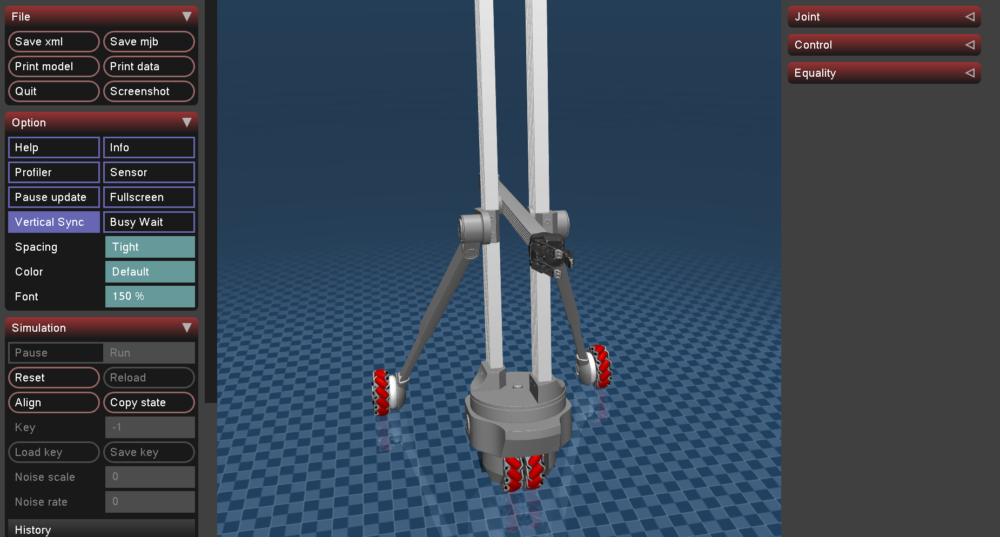
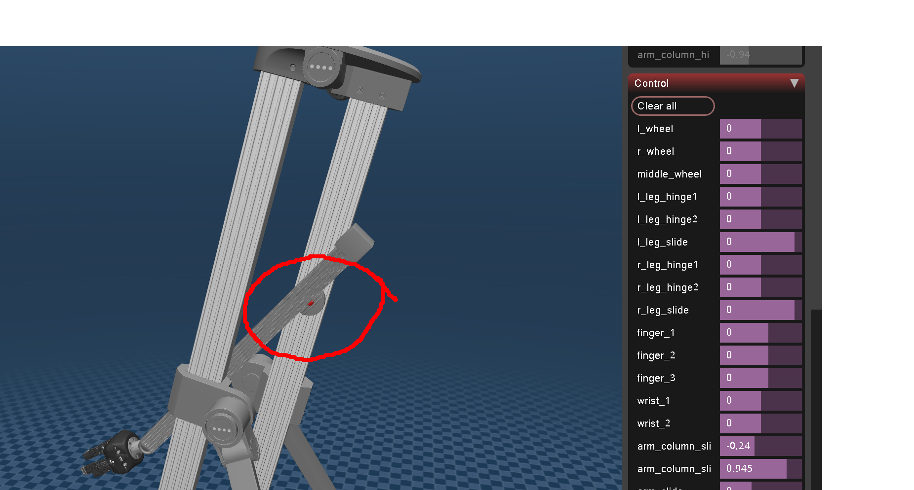

# Tripod Mobile Manipulator

A MuJoCo simulation package of the Obotx tripod mobile manipulator, including model, simulation scripts, and documentation, with a one-command launch.

## Setup instructions on Linux

- Open a terminal and run the following commands (one line at a time):

```bash
# install required system libraries
sudo apt update
sudo apt install -y libglfw3 libglew2.2 libgl1-mesa-glx libosmesa6

# install uv
curl -LsSf https://astral.sh/uv/install.sh | sh
source ~/.bashrc

# unzip project
cd MUJOCO/Tripod

# create a virtual environment
uv venv
source .venv/bin/activate

# install dependencies
uv sync
```

## Usage

open a terminal and run `uv run obotx-sim` to launch the simulation

## Simulation interface



You can hide the left panel by pressing `Tab` key. Press *Control* in the right panel to show an interactive menu to control the joints and wheels (The unit is in rad for a revolute joint and m for a prismatic joint).

The joints and control method are as follows:

- Wheels:
  - `middle_wheel`: middle wheel, velocity control
  - `l_wheel`: left wheel, velocity control
  - `r_wheel`: right wheel, velocity control
- Left leg:
  - `l_leg_hinge1`: revolute joint connect to column, position control
  - `l_leg_hinge2`: revolute joint, position control
  - `l_leg_slide`: prismatic joint, position control
- Right leg:
  - `r_leg_hinge1`: revolute joint connect to column, position control
  - `r_leg_hinge2`: revolute joint, position control
  - `r_leg_slide`: prismatic joint, position control
- Arm:
  - `arm_column_slide_1` and `arm_column_slide_2`: two sliders on the columns
  - `arm_slide`: prismatic joint along the arm's long axis, position control
- Gripper
  - `wrist_1` and `wrist_2`: two revolute joints control the wrist orientation, position control
  - `finger_1` and `finger_2` and `finger_3`: three revolute joints control the gripper opening, position control

## Package structure

```
├── models/                      # model files for Mujoco
│   ├── obotx.xml                # robot model
│   ├── scene.xml                # scene model
│   └── exported/                # mesh files exported from Blender
├── src/                         # source files for simulation scripts
│   ├── obotx_sim                # python package
│   │   ├── main.py              # entry point
└── pyproject.toml               # configuration file for uv
```


## Limitations

- Currently mass and inertia is not set up correctly in the model. Mujoco will infer the mass and inertia value from the mesh files exported from Blender, but they are too large and unrealistic.

- To model the joints between the arm and the two sliders on the column (loop closure), I put the arm in the kinematic tree of 1 slider and use a *constraint* to connect the arm and the other slider. You will see a slight displacement between the arm and this slider because constraints in Mujoco are "soft" (the constraint may be violated) (see image below).



- You can update the joint limits in the `range` field of the `joint` attribute in `obotx.xml` (units are meter for slide/prismatic joint and rad for hinge/revolute joint). For example:

    ```
    <joint name="arm_slide" type="slide" axis="0 1 0" range="-0.8 0.8"/>
    ```
