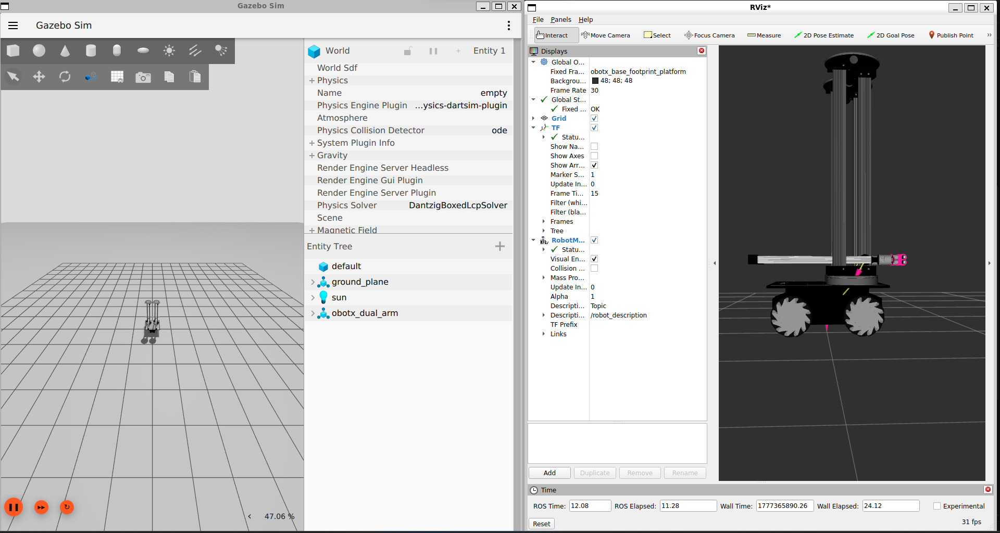

# ROS 2 Version: MORPH Series – Mobile Omni Robotic Platform with Hands

https://github.com/user-attachments/assets/563591b3-1618-4647-abff-0013cb8a69b0

The **MORPH** series implements two distinct parallel manipulator configurations mounted on an omnidirectional mobile base. Both variants utilize chained mechanisms but differ fundamentally in their kinematic architecture.

> **Note:** This documentation covers the **ROS 2 Jazzy** implementation using **Gazebo Harmonic**.

## MORPH-I (Type I) : Dual Independent Parallel Manipulators
This configuration features two completely separate manipulators mounted side-by-side on the mobile base. There is no mechanical coupling between the left and right sides, allowing for independent operation.

**Kinematic Structure (Per Arm):**
- **Base Revolute Joint**: Rotates the entire column assembly
- **Vertical Prismatic Columns**: Left and right sliding columns
- **Horizontal Bar**: Connects the tops of both columns
- **End-Effector**: Mounted on the horizontal bar mechanism

---

## Prerequisites

Before proceeding, ensure you have the following installed:
1. **ROS 2 Jazzy Jalisco**
2. **Gazebo Harmonic**

If you have not installed these yet, please refer to the official installation guides:
- [Install ROS 2 Jazzy](https://docs.ros.org/en/jazzy/Installation.html)
- [Install Gazebo Harmonic](https://gazebosim.org/docs/harmonic/install_ubuntu/)

---

## Quick Start Guide

https://github.com/user-attachments/assets/cead9334-a670-4825-82e9-ccdc08dcac1e

### 1. Build the Workspace

Navigate to the root of the ROS Quadruped package directory and build the packages

```bash
# Navigate to the package directory
cd mobile-manipulator/ROS/Quadruped

# Build the packages with symlink install for faster development
colcon build --symlink-install

# Source the environment
source install/setup.bash

# Launch the main bringup file to start Gazebo and spawn the robot
ros2 launch mm_bringup obotx_dual_arm.launch.py
```

The visualization looks like this :

### 2. Control the Robot
Open a new terminal.

- Mobile Base Control
    Use the standard teleop twist keyboard to drive the omnidirectional base
    ```bash
    ros2 run teleop_twist_keyboard teleop_twist_keyboard --ros-args -p stamped:=true
    ```
- Arm Control (Example)
    You can send joint trajectory goals directly via the command line to test arm movements. Below is an example sequence for the Left Arm.
    ```bash
    ros2 action send_goal /left_arm_controller/follow_joint_trajectory control_msgs/action/FollowJointTrajectory "{trajectory: {
    joint_names: [
        obotx_left_arm_mount_joint,
        obotx_left_joint_slider_left_slide,
        obotx_left_joint_slider_left_hinge,
        obotx_left_joint_telescopic_slide,
        obotx_left_joint_hinge_telescopic_hand,
        obotx_left_j_dg_1_2,
        obotx_left_j_dg_2_2,
        obotx_left_j_dg_3_2,
        obotx_left_j_dg_4_2,
        obotx_left_j_dg_1_inner,
        obotx_left_j_dg_4_inner
    ],
    points: [
        {
        positions: [0.0, 0.9, -0.2, 0.6, 0.8, 0, 0, 0, 0, 0, 0],
        time_from_start: {sec: 3}
        },
        {
        positions: [0.0, 0.3, 0.2, 0.0, 0.0, 1.5, 1.5, 1.5, 1.5, 0, 0],
        time_from_start: {sec: 6}
        },
        {
        positions: [0.0, 0.7, 0.0, 0.6, -0.7, 0, 0, 0, 0, 0, 0],
        time_from_start: {sec: 9}
        },
        {
        positions: [0.0, 0.2, 0.0, 0.0, 0.0, 1.5, 1.5, 1.5, 1.5, 0, 0],
        time_from_start: {sec: 12}
        }
    ]
    ```
    
## Joint Interface Reference

| Left Arm Joints | Right Arm Joints | Type | Description |
| :--- | :--- | :--- | :--- |
| `obotx_left_arm_mount_joint` | `obotx_right_arm_mount_joint` | Revolute | Base rotation of the arm assembly |
| `obotx_left_joint_slider_left_slide` | `obotx_right_joint_slider_left_slide` | Prismatic | Vertical slide (Left Column) |
| `obotx_left_joint_slider_left_hinge` | `obotx_right_joint_slider_left_hinge` | Prismatic | Vertical slide (Hinge/Column) |
| `obotx_left_joint_telescopic_slide` | `obotx_right_joint_telescopic_slide` | Prismatic | Telescopic extension |
| `obotx_left_joint_hinge_telescopic_hand` | `obotx_right_joint_hinge_telescopic_hand` | Revolute | Hand orientation hinge |
| `obotx_left_joint_slider_right_slide` | `obotx_right_joint_slider_right_slide` | Prismatic | Vertical slide (Right Column) |
| **Gripper Finger 1** | | | |
| `obotx_left_j_dg_1_1` | `obotx_right_j_dg_1_1` | Revolute | Finger 1 Joint 1 |
| `obotx_left_j_dg_1_2` | `obotx_right_j_dg_1_2` | Revolute | Finger 1 Joint 2 |
| `obotx_left_j_dg_1_3` | `obotx_right_j_dg_1_3` | Revolute | Finger 1 Joint 3 |
| `obotx_left_j_dg_1_4` | `obotx_right_j_dg_1_4` | Revolute | Finger 1 Joint 4 |
| **Gripper Finger 2** | | | |
| `obotx_left_j_dg_2_1` | `obotx_right_j_dg_2_1` | Revolute | Finger 2 Joint 1 |
| `obotx_left_j_dg_2_2` | `obotx_right_j_dg_2_2` | Revolute | Finger 2 Joint 2 |
| `obotx_left_j_dg_2_3` | `obotx_right_j_dg_2_3` | Revolute | Finger 2 Joint 3 |
| `obotx_left_j_dg_2_4` | `obotx_right_j_dg_2_4` | Revolute | Finger 2 Joint 4 |
| **Gripper Finger 3** | | | |
| `obotx_left_j_dg_3_1` | `obotx_right_j_dg_3_1` | Revolute | Finger 3 Joint 1 |
| `obotx_left_j_dg_3_2` | `obotx_right_j_dg_3_2` | Revolute | Finger 3 Joint 2 |
| `obotx_left_j_dg_3_3` | `obotx_right_j_dg_3_3` | Revolute | Finger 3 Joint 3 |
| `obotx_left_j_dg_3_4` | `obotx_right_j_dg_3_4` | Revolute | Finger 3 Joint 4 |
| **Gripper Finger 4** | | | |
| `obotx_left_j_dg_4_1` | `obotx_right_j_dg_4_1` | Revolute | Finger 4 Joint 1 |
| `obotx_left_j_dg_4_2` | `obotx_right_j_dg_4_2` | Revolute | Finger 4 Joint 2 |
| `obotx_left_j_dg_4_3` | `obotx_right_j_dg_4_3` | Revolute | Finger 4 Joint 3 |
| `obotx_left_j_dg_4_4` | `obotx_right_j_dg_4_4` | Revolute | Finger 4 Joint 4 |
| **Inner/Grip Joints** | | | |
| `obotx_left_j_dg_1_inner` | `obotx_right_j_dg_1_inner` | Revolute | Inner Grip Joint 1 |
| `obotx_left_j_dg_4_inner` | `obotx_right_j_dg_4_inner` | Revolute | Inner Grip Joint 4 |
